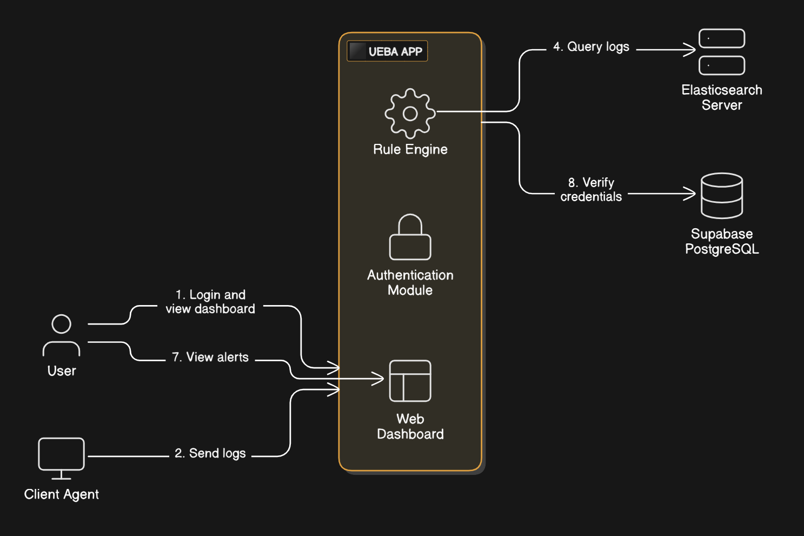

# 🔐 Securewithin: Network-Based UEBA System


**Securewithin: A network based UEBA** is a network-based **User and Entity Behavior Analytics (UEBA)** system designed to monitor and analyze user behavior and entity interactions across the network in real-time. It uses the **ELK Stack (Elasticsearch, Logstash, Kibana)** and **Packetbeat** for collecting, enriching, storing, visualizing, and analyzing network traffic logs.

---

## 📘 Overview

Securewithin-A leverages network-level telemetry to detect anomalies by analyzing patterns of user and entity behavior. The architecture is built around structured log collection from endpoints using Packetbeat, central aggregation with Logstash, storage in Elasticsearch, visualization in Kibana, and behavioral analysis via a dedicated UEBA module.

---

## 🧠 How It Works

1. **Packetbeat** runs on client machines and captures real-time network traffic.
2. Captured data is sent to **Logstash**, where it is enriched with metadata like `client_id` and `client_name`.
3. Logs are indexed in **Elasticsearch** for searchability and analysis.
4. **Kibana** provides dashboards and tools for visualizing behavior patterns and detecting anomalies.
5. A **UEBA engine** analyzes the stored data to identify suspicious activity and generate alerts.

---

## 🖥️ System Architecture


---

## ⚙️ Installation & Configuration

### 📌 Prerequisites

- Java 8 or higher
- ELK Stack (Elasticsearch, Logstash, Kibana)
- Packetbeat
- HTTPS access if using secured communication

---

### 🏗️ Installation Steps

#### 1. **Install Elasticsearch**

Download and extract the ZIP package:
```bash
cd elasticsearch-<version>/bin
./elasticsearch.bat
```
Verify it’s running at: **http://localhost:9200**

#### 2. **Install Kibana**

Extract and run:
```bash
cd kibana-<version>/bin
./kibana.bat
```

Access at: **http://localhost:5601**

#### 3. **Install and Configure Logstash**

Create *logstash.conf*:
```bash
input {
  beats {
    port => 5044
  }
}

filter {
  mutate {
    add_field => { "client_id" => "%{[client_id]}" }
    add_field => { "client_name" => "%{[client_name]}" }
  }
}

output {
  elasticsearch {
    hosts => ["https://localhost:9200"]
    user => "elastic"
    password => "YOUR_ELASTICSEARCH_PASSWORD"
    ssl_certificate_verification => false
    index => "YOUR_INDEX_NAME"
  }
}
```

Run Logstash:
```bash
cd logstash-<version>/bin
./logstash.bat -f path\to\logstash.conf
```

#### 4. **Install and Configure Packetbeat (On Clients)**
Edit *packetbeat.yml*:
```bash
packetbeat.interfaces.device: 3

packetbeat.interfaces.internal_networks:
  - private

packetbeat.flows:
  timeout: 30s
  period: 5s

packetbeat.protocols:
  - type: dns
    ports: [53]

  - type: http
    ports: [80, 8080, 8000, 5000, 8002]
    send_request: true
    send_response: true
    include_body_for: ["application/json", "text/html"]
    real_ip_header: "X-Forwarded-For"

  - type: tls
    ports:
      - 443
      - 993
      - 995
      - 5223
      - 8443
      - 8883
      - 9243
    include_raw_details: true
    fingerprint: true

output.logstash:
  hosts: ["localhost:5044"]

processors:
  - add_fields:
      target: ''
      fields:
        client_id: "clientA"
        client_name: "Jeff Bezos"
```

Run Packetbeat:
```bash
cd packetbeat-<version>
./packetbeat.exe -c path\to\packetbeat.yml -e -d "*"
```

---

## 🧪 Running the System

Start services in order:

1. **Elasticsearch**
2. **Kibana**
3. **Logstash**
4. **Packetbeat** *(on each client machine)*

Access Kibana at: [http://localhost:5601](http://localhost:5601)

---

## 🛠️ Important Notes

- ✅ Install **Logstash + Packetbeat** on every client machine.
- 🖥️ Run **Elasticsearch, Kibana, and UEBA system** on a **centralized admin server**.
- 🔗 Ensure `client_id` matches between Packetbeat and Logstash configurations for correct data mapping.

---

## 📊 Visualizations & Alerts

- **Dashboards**: Use Kibana to create dashboards tracking:
  - Network traffic volume
  - Protocol usage (HTTP, DNS, TLS, etc.)
  - Top users/entities by activity
- **Alerts**: Set up alert triggers in Kibana based on:
  - Behavioral anomalies
  - Unusual login times
  - High-volume DNS or HTTP requests
  - Suspicious TLS/SSL patterns

---

## 🤝 Contributions

Contributions are welcome! Please fork the repository and submit a pull request with your enhancements.

Feel free to open issues for bugs, feature requests, or questions.

---

## 📄 License

This project is licensed under the **MIT License** – see the [LICENSE](LICENSE) file for details.

---

Thank you for using **Securewithin**!

